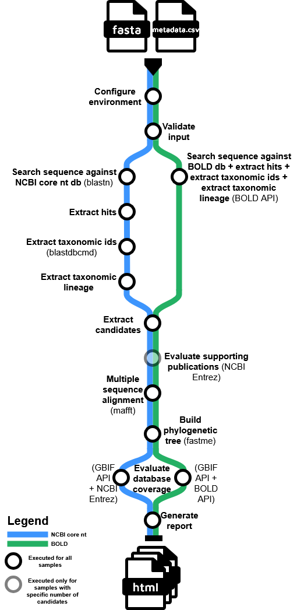

# Meet TAXAPUS - your eight-armed taxonomy assistant!
<table>
  <tr>
    <td style="vertical-align:top; width:50%;">
      
    </td>
    <td style="vertical-align:top; width:50%;">
      <strong>qcif/taxapus</strong> is a modular, reproducible Nextflow workflow for the conservative taxonomy assignment to DNA sequences, designed for high-confidence, auditable results in biosecurity and biodiversity contexts. The workflow integrates multiple bioinformatics tools and databases, automates best-practice analysis steps, and produces detailed reports with supporting evidence for each taxonomic assignment.
    </td>
  </tr>
</table>

<p align="center" style="max-width:400px; margin:auto;">
    
</p>

### Workflow Overview

The pipeline orchestrates a series of analytical steps, each encapsulated in a dedicated module or subworkflow. The main stages are:

1. **Environment Configuration** Sets up environment variables and paths required for downstream processes, ensuring reproducibility and portability.

2. **Input Validation** Checks the integrity and compatibility of input files (FASTA sequences, metadata, databases), preventing downstream errors.

3. **Sequence Search**  
   - **[BLAST Core Nucleotide Database](https://ncbiinsights.ncbi.nlm.nih.gov/2024/07/18/new-blast-core-nucleotide-database/) ([BLASTN](https://blast.ncbi.nlm.nih.gov/Blast.cgi)):** Queries input sequences against the NCBI nucleotide database using BLASTN.
   - **[BOLD v4](https://v4.boldsystems.org/) ([API](https://v4.boldsystems.org/index.php/api_home)):** Queries input sequences against the Barcode of Life Data Systems. Taxonomic lineage included in the results.

4. **Hit Extraction** Parses BLAST results to extract relevant hits for each query.

5. **Taxonomic ID Extraction** Retrieves taxonomic IDs for BLAST hits.

6. **Taxonomic Lineage Extraction** Maps taxonomic IDs to full lineages, enabling downstream filtering and reporting.

7. **Candidate Extraction** Identifies candidate species for each query, applying user-defined thresholds for identity and coverage.

8. **Supporting Evidence Evaluation**  
   - **Publications Diversity:** Assesses the diversity of data sources supporting each candidate.
   - **Database Coverage:** Evaluates the representation of candidates in global databases ([GBIF](https://www.gbif.org/), [GenBank](https://www.ncbi.nlm.nih.gov/genbank/), [BOLD](https://v4.boldsystems.org/)).

9. **Multiple Sequence Alignment ([MAFFT](https://mafft.cbrc.jp/alignment/server/index.html))** Aligns candidate and query sequences to prepare for phylogenetic analysis.

10. **Phylogenetic Tree Construction ([FastMe](http://www.atgc-montpellier.fr/fastme/))** Builds a phylogenetic tree to visualise relationships among candidates and queries.

11. **Comprehensive Reporting** Generates detailed HTML and text reports, including sequence alignments, phylogenetic trees, database coverage, and all supporting evidence for each assignment.

## Usage

### Software

To run the **qcif/taxapus** pipeline, you will need the following software installed:

- **[Nextflow](https://www.nextflow.io/)**  
  *Tested versions: 24.10.3, 24.10.6*  

- **[Java](https://www.java.com/en/)**  
  Required by Nextflow.  
  *Tested version: 17.0.13*  

- **[Singularity](https://docs.sylabs.io/guides/3.7/admin-guide/)**  
  Used for containerised execution of all bioinformatics tools, ensuring reproducibility.  
  *Tested version: 3.7.0*  

> [!NOTE]
> - Instructions on how to set up Nextflow and a compatible version of Java can be found on [this page](https://www.nextflow.io/docs/latest/install.html#installation).
> - To install singularity follow instructions from [this website](https://docs.sylabs.io/guides/3.7/admin-guide/installation.html#before-you-begin).
> - We provide different [profiles](conf/profiles.config) as per the default nf-core configuration however this pipeline was only tested with singularity.
> - The pipeline was tested only on a Linux-based operating system - specifically, [Ubuntu 24.04.1 LTS](https://fridge.ubuntu.com/2024/08/30/ubuntu-24-04-1-lts-released/).
> - If you have never downloaded or run a Nextflow pipeline, we have some additional tips and bash commands in the [step-by-step guide](docs/step_by_step.md). 

### NCBI API Key

API Key is used to authenticate with the NCBI Entrez API for an increased rate limit. You can generate it following the instructions from [this article](https://support.nlm.nih.gov/kbArticle/?pn=KA-05317).

### TaxonKit

[Download the NCBI taxonomy data files](https://ftp.ncbi.nih.gov/pub/taxonomy/taxdump.tar.gz) and extract them to `~/.taxonkit`. Similarly, [download the taxonkit tool](https://github.com/shenwei356/taxonkit/releases) and move into the same folder.

### BLAST Core Nucleotide Database

To search sequences against the BLAST Core Nucleotide Database, you must download it first. We recommend running the `update_blastdb.pl` program. Follow instructions from [this book](https://www.ncbi.nlm.nih.gov/books/NBK569850/). [Perl installation](https://www.perl.org/get.html) is required.
The command should look like this:
`perl ~/ncbi-blast-2.16.0+/bin/update_blastdb.pl --decompress core_nt`

### Sequences file (`sequences.fasta`)

You will need a FASTA file containing the query sequences (up to 100), e.g.
```
>VE24-1075_COI
TGGATCATCTCTTAGAATTTTAATTCGATTAGAATTAAGACAAATTAATTCTATTATTWATAATAATCAATTATATAATGTAATTGTTCACAATTCATGCTTTTATTATAATTTTTTTTATAACTATACCAATTGTAATTGGTGGATTTGGAAATTGATTAATTCCTATAATAATAGGATGTCCTGATATATCATTTCCACSTTTAAATAATATTAGATTTTGATTATTACCTCCATCATTAATAATAATAATTTGTAGATTTTTAATTAATAATGGAACAGGAACAGGATGAACAATTTAYCCHCCTTTATCAAACAATATTGCACATAATAACATTTCAGTTGATTTAACTATTTTTTCTTTACATTTAGCAGGWATCTCATCAATTTTAGGAGCAATTAACTTTATTTGTACAATTCTTAATATAATAYCAAAYAATATAAAACTAAATCAAATTCCTCTTTTTCCTTGATCAATTTTAATTACAGCTATTTTATTAATTTTATMTTTACCAGTTTTAGCTGGTGCCATTACAATATTATTAACTGATCGTAATTTAAATACATCATTTTTGATCCAGCAGGAGGAGGAGATCC
>VE24-1079_COI
AACTTTATATTTCATTTTTGGAATATGGGCAGGTATATTAGGAACTTCACTAAGATGAATTATTCGAATTGAACTTGGACAACCAGGATCATTTATTGGAGATGATCAAATTTATAATGTAGTAGTTACCGCACACGCATTTATTATAATTTTCTTTATAGTTATACCAATTATAATTGGAGGATTTGGAAATTGATTAGTACCTCTAATAATTGGAGCACCAGATATAGCATTCCCACGGATAAATAATATAAGATTTTGATTATTACCACCCTCAATTACACTTCTTATTATAAGATCTATAGTAGAAAGAGGAGCAGGAACTGGATGAACAGTATATCCCCCACTATCATCAAATATTGCACATAGTGGAGCATCAGTAGACCTAGCAATTTTTTCACTACATTTAGCAGGTGTATCTTCAATTTTAGGAGCAATTAATTTCATCTCAACAATTATTAATATACGACCTGAAGGCATATCTCCAGAACGAATTCCATTATTTGTATGATCAGTAGGTATTACAGCATTACTATTATTATTATCATTACCAGTTCTAGCTGGAGCTATTACAATATTATTAACAGATCGAAACTTTAATACCTCATTCTTTGACCCAGTAGGAGGAGGAGATCCTATCTTATATCAACATTTATTTTGATTTTTT
```
> [!NOTE]
> - Example can be downloaded from [`test/query.fasta`](test/query.fasta).


### Metadata file (`metadata.csv`)

The metadata file provides essential information about each sequence and must follow the structure below. Each row corresponds to a sample and should include required and, optionally, additional columns.

#### Required Columns
1. **sample_id** - Unique identifier for the sample. Must match the sequence ID in the `sequences.fasta` file. Cannot contain spaces.
2. **locus** - Name of the genetic locus for the sample. Choose from the following:
- NA (for samples with no locus, e.g. viruses or BOLD runs)
- 16s
- 28s
- act
- alt-a1
- ß-tub
- cmda
- co2
- coi
- cytb
- dnax
- ef1a
- fusa
- gapa
- gyrb
- hsp60
- its
- its1
- its2
- leus
- lsu
- matk
- rbcl
- recn
- reca
- rpob
- rplb
- rpod
- rpb2
> [!NOTE]
> - Loci synonyms will be checked as well (see [`assets/loci.json`](assets/loci.json)). 
> - If you need to modify which loci and synonyms are permitted, see the [technical documentation](docs/detailled_tech.md).
3. **preliminary_id** - Preliminary morphology ID of the sample.

#### Optional Columns
1. **taxa_of_interest** - Taxa of interest for the sample. If multiple, separate them with a `|` character.
2. **host** - Host organism of the sample.
3. **country** - Country of origin for the sample.
4. **sequencing_platform** - Sequencing platform used for the sample.
5. **sequencing_read_coverage** - Sequencing read coverage for the sample.

#### Example

<table>
    <thead>
        <tr>
            <th>sample_id</th>
            <th>locus</th>
            <th>preliminary_id</th>
            <th>taxa_of_interest</th>
            <th>host</th>
            <th>country</th>
            <th>sequencing_platform</th>
            <th>sequencing_read_coverage</th>
        </tr>
    </thead>
    <tbody>
        <tr>
            <td>VE24-1075_COI</td>
            <td>COI</td>
            <td>Aphididae</td>
            <td>Myzus persicae|Aphididae</td>
            <td>Cut flower Rosa</td>
            <td>Ecuador</td>
            <td>Nanopore</td>
            <td>30x</td>
        </tr>
        <tr>
            <td>VE24-1079_COI</td>
            <td>COI</td>
            <td>Miridae</td>
            <td>Lygus pratensis</td>
            <td>Cut flower Paenonia</td>
            <td>Netherlands</td>
            <td>Nanopore</td>
            <td>30x</td>
        </tr>
    </tbody>
</table>

> [!NOTE]
> - All required columns must be present for every sample.
> - Optional columns can be left blank or completely omitted if not applicable.
> - For more details on the metadata schema, see [`assets/schema_input.json`](assets/schema_input.json).
> - Example can be downloaded from [`test/metadata.csv`](test/metadata.csv).

You can run the pipeline using the BLAST Core Nucleotide Database:
```bash
nextflow run /path/to/pipeline/taxapus/main.nf \
    --metadata /path/to/metadata.csv \
    --sequences /path/to/sequences.fasta \
    --blastdb /path/to/blastdbs/core_nt \
    --outdir /path/to/output \
    -profile singularity \
    --taxdb /path/to/.taxonkit/ \
    --ncbi_api_key API_KEY \
    --ncbi_user_email EMAIL \
    --analyst_name "Magdalena Antczak" \
    --facility_name "QCIF" \
    -resume
```

You can also run the pipeline using the BOLD database with the following command:

```bash
nextflow run /path/to/pipeline/taxapus/main.nf \
    --metadata /path/to/metadata.csv \
    --sequences /path/to/sequences.fasta \
    --db_type bold \
    --outdir /path/to/output \
    -profile singularity \
    --taxdb /path/to/.taxonkit/ \
    --ncbi_api_key API_KEY \
    --ncbi_user_email EMAIL \
    --analyst_name "Magdalena Antczak" \
    --facility_name "QCIF" \
    -resume
```

> [!NOTE]
> - For a detailed explanation of all pipeline parameters, see [parameter documentation](docs/params.md).
> - We recommend avoiding spaces in file and folder names to prevent issues in command-line operations.
> - You can find detailed instructions and practical examples for customising the pipeline configuration in the [docs/customise.md](docs/customise.md) file. This guide covers how to set parameters, adjust resources, change error strategies, and modify the Singularity cache directory for your Nextflow runs.


## Pipeline output
After running the pipeline, the output directory will contain a separate folder for each query sequence and a folder with information about the run. Here, we show the results folder structure when using the two databases. For more information, see the [output documentation](docs/output.md). See [this document](https://qcif.github.io/daff-biosecurity-wf2/understanding-the-analysis.html) for tips on understanding the analysis and interpreting the final HTML report.

**BLAST Core Nucleotide Database**

```
.
├── blast_result.xml
├── pipeline_info
│   ├── execution_report_2025-06-22_22-53-15.html
│   ├── execution_timeline_2025-06-22_22-53-15.html
│   ├── execution_trace_2025-06-22_22-53-15.txt
│   ├── params_2025-06-22_22-53-29.json
│   └── pipeline_dag_2025-06-22_22-53-15.html
├── query_001_VE24-1075_COI
│   ├── all_hits.fasta
│   ├── candidates.csv
│   ├── candidates.fasta
│   ├── candidates_identity_boxplot.png
│   ├── candidates_phylogeny.fasta
│   ├── candidates_phylogeny.msa
│   ├── candidates_phylogeny.nwk
│   └── report_VE24-1075_COI_20250622_225319.html
└── query_002_VE24-1079_COI
    ├── all_hits.fasta
    ├── candidates.csv
    ├── candidates.fasta
    ├── candidates_phylogeny.fasta
    ├── candidates_phylogeny.msa
    ├── candidates_phylogeny.nwk
    └── report_VE24-1079_COI_20250622_225319.html
```
**BOLD**
```
.
├── pipeline_info
│   ├── execution_report_2025-06-22_22-53-22.html
│   ├── execution_timeline_2025-06-22_22-53-22.html
│   ├── execution_trace_2025-06-22_22-53-22.txt
│   ├── params_2025-06-22_22-53-34.json
│   └── pipeline_dag_2025-06-22_22-53-22.html
├── query_001_VE24-1075_COI
│   ├── all_hits.fasta
│   ├── candidates.csv
│   ├── candidates.fasta
│   ├── candidates_phylogeny.fasta
│   ├── candidates_phylogeny.msa
│   ├── candidates_phylogeny.nwk
│   └── report_BOLD_VE24-1075_COI_20250622_225326.html
└── query_002_VE24-1079_COI
    ├── all_hits.fasta
    ├── candidates.csv
    ├── candidates.fasta
    ├── candidates_identity_boxplot.png
    ├── candidates_phylogeny.fasta
    ├── candidates_phylogeny.msa
    ├── candidates_phylogeny.nwk
    └── report_BOLD_VE24-1079_COI_20250622_225326.html
```
## Credits
<p align="center">
    
    &nbsp;&nbsp;&nbsp;&nbsp;
    
    &nbsp;&nbsp;&nbsp;&nbsp;
    
</p>

qcif/taxapus was originally written by [Magdalena Antczak](https://github.com/mantczakaus/), [Cameron Hyde](https://github.com/neoformit), [Daisy Li](https://github.com/daisyli-qcif) from [QCIF Ltd](https://www.qcif.edu.au/). The project was funded by the [Department of Agriculture, Fisheries and Forestry](https://www.agriculture.gov.au/) and the [Australian BioCommons](https://www.biocommons.org.au/).

The workflow was designed by:
- Cameron Hyde
- Magdalena Antczak
- Lanxi (Daisy) Li
- Valentine Murigneux
- Sarah Williams
- Michael Thang
- Bradley Pease
- Shaun Bochow
- Grace Sun

## Citations

If you use **qcif/taxapus** for your analysis, please cite it using the following
> Antczak, M., Hyde, C., Li, Lanxi (Daisy), Murigneux, V., Williams, S., Thang, M., Pease, B., Bochow, S., & Sun, G. (2025). TAXAPUS - your eight-armed taxonomy assistant. WorkflowHub. https://doi.org/10.48546/WORKFLOWHUB.WORKFLOW.1782.1

An extensive list of references for the tools used by the pipeline can be found in the [CITATIONS.md](CITATIONS.md) file.

**qcif/taxaplus** uses code and infrastructure developed and maintained by the [nf-core](https://nf-co.re) community, reused here under the [MIT license](https://github.com/nf-core/tools/blob/main/LICENSE).

> **The nf-core framework for community-curated bioinformatics pipelines.**
>
> Philip Ewels, Alexander Peltzer, Sven Fillinger, Harshil Patel, Johannes Alneberg, Andreas Wilm, Maxime Ulysse Garcia, Paolo Di Tommaso & Sven Nahnsen.
>
> _Nat Biotechnol._ 2020 Feb 13. doi: [10.1038/s41587-020-0439-x](https://dx.doi.org/10.1038/s41587-020-0439-x).
