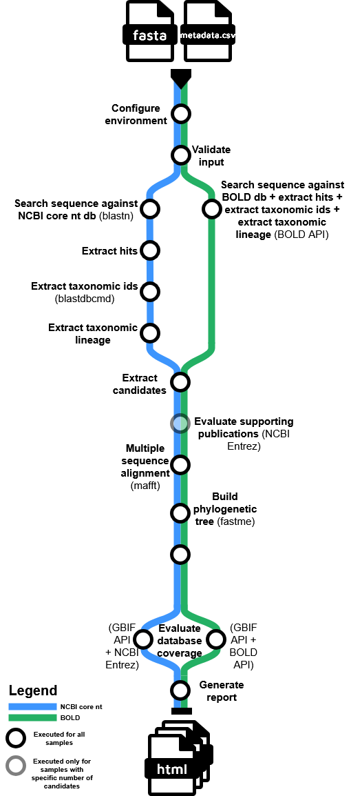

# daff/taxassignwf

## Introduction

**daff/taxassignwf** is a modular, reproducible Nextflow workflow for the conservative taxonomy assignment to DNA sequences, designed for high-confidence, auditable results in biosecurity and biodiversity contexts. The workflow integrates multiple bioinformatics tools and databases, automates best-practice analysis steps, and produces detailed reports with supporting evidence for each taxonomic assignment.
<p align="center" style="max-width:400px; margin:auto;">
    
</p>

### Workflow Overview

The pipeline orchestrates a series of analytical steps, each encapsulated in a dedicated module or subworkflow. The main stages are:

1. **Environment Configuration** Sets up environment variables and paths required for downstream processes, ensuring reproducibility and portability.

2. **Input Validation** Checks the integrity and compatibility of input files (FASTA sequences, metadata, databases), preventing downstream errors.

3. **Sequence Search**  
   - **NCBI core nt (BLASTN):** Queries input sequences against the NCBI nucleotide database using BLASTN.
   - **BOLD (API):** Queries input sequences against the Barcode of Life Data. Taxonomic lineage included in the results.

4. **Hit Extraction** Parses BLAST results to extract relevant hits for each query.

5. **Taxonomic ID Extraction** Retrieves taxonomic IDs for BLAST hits.

6. **Taxonomic Lineage Extraction** Maps taxonomic IDs to full lineages, enabling downstream filtering and reporting.

7. **Candidate Extraction** Identifies candidate species for each query, applying user-defined thresholds for identity and coverage.

8. **Supporting Evidence Evaluation**  
   - **Publications Diversity:** Assesses the diversity of data sources supporting each candidate.
   - **Database Coverage:** Evaluates the representation of candidates in global databases (GBIF, NCBI, BOLD).

9. **Multiple Sequence Alignment (MAFFT)** Aligns candidate and query sequences to prepare for phylogenetic analysis.

10. **Phylogenetic Tree Construction (FASTME)** Builds a phylogenetic tree to visualise relationships among candidates and queries.

11. **Comprehensive Reporting** Generates detailed HTML and text reports, including sequence alignments, phylogenetic trees, database coverage, and all supporting evidence for each assignment.

## Setup

### Software

1. Instructions on how to set up Nextflow and a compatible version of Java on [this page](https://www.nextflow.io/docs/latest/install.html#installation).
2. To install singularity follow instructions from [this website](https://docs.sylabs.io/guides/3.7/admin-guide/installation.html#before-you-begin).

The following versions of the programs were used to test this pipeline:

<table border="1" style="border-collapse: collapse;">
    <tr>
        <th style="border: 1px solid;">Program</th>
        <th style="border: 1px solid;">Version</th>
    </tr>
    <tr>
        <td style="border: 1px solid;">Singularity</td>
        <td style="border: 1px solid;">3.7.0</td>
    </tr>
    <tr>
        <td style="border: 1px solid;">Java</td>
        <td style="border: 1px solid;">17.0.13</td>
    </tr>
    <tr>
        <td style="border: 1px solid;">Nextflow</td>
        <td style="border: 1px solid;">24.10.3</td>
    </tr>
</table>

### Databases
1. Download a preformatted NCBI BLAST database `core_nt` database by running the update_blastdb.pl program. Follow instructions from [this book](https://www.ncbi.nlm.nih.gov/books/NBK569850/). [Perl installation](https://www.perl.org/get.html) is required.
The command should look like this:
`perl ~/ncbi-blast-2.16.0+/bin/update_blastdb.pl --decompress core_nt`
2. Download the NCBI taxonomy data files from https://ftp.ncbi.nih.gov/pub/taxonomy/taxdump.tar.gz and extract them to `~/.taxonkit`. Similarly, download the taxonkit tool from https://github.com/shenwei356/taxonkit/releases and move into the same folder.

### Download pipeline
Enter the folder where you want the pipeline to be and run the following:
```
git clone https://github.com/qcif/nf-daff-biosecurity-wf2.git
```
If you want to run a specific version, add a branch to the command (see tags for available versions), e.g.
```
git clone https://github.com/qcif/nf-daff-biosecurity-wf2.git --branch v0.1.0
```

## Input
### Required
The mandatory input includes the following parameters:
- metadata /path/to/metadata.csv: The metadata file containing information about the sequences.
- sequences /path/to/queries.fasta: The FASTA file containing the query sequences (up to 100).
- blastdb /path/to/blastdbs/core_nt: The BLAST database to be used for query searching. Your `/path/to/blastdbs` folder should contain the following files:
- core_nt with extensions `.nal`, `.ndb`, `.njs`, `.nos`, `.not`, `.ntf` and `.nto`
- multiple volumes of core_nt, named core_nt.`NUM` with extensions `.nhr`, `.nin`, `.nnd`, `.nni`, `.nog`, `.nsq`
- taxdb.btd and taxdb.bti files
- outdir /path/to/output: The output directory where the results will be stored.
- taxdb /path/to/.taxonkit/: The path to the taxonomic database NCBI Taxonomy Toolkit. Following files should be available in that folder: citations.dmp, division.dmp, gencode.dmp, merged.dmp, nodes.dmp, taxonkit, delnodes.dmp, gc.prt, images.dmp, names.dmp and readme.txt

### Recommended
You can [generate an NCBI API key](https://support.nlm.nih.gov/kbArticle/?pn=KA-05317) to eliminate restrictions on Entrez queries and make the database coverage evaluation process faster. Pass it with the following parameters:
- ncbi_api_key <your_key_123>
- user_email <me@example.com>


### Sequences file (`queries.fasta`)
#### Example
```
>VE24-1075_COI
TGGATCATCTCTTAGAATTTTAATTCGATTAGAATTAAGACAAATTAATTCTATTATTWATAATAATCAATTATATAATGTAATTGTTCACAATTCATGCTTTTATTATAATTTTTTTTATAACTATACCAATTGTAATTGGTGGATTTGGAAATTGATTAATTCCTATAATAATAGGATGTCCTGATATATCATTTCCACSTTTAAATAATATTAGATTTTGATTATTACCTCCATCATTAATAATAATAATTTGTAGATTTTTAATTAATAATGGAACAGGAACAGGATGAACAATTTAYCCHCCTTTATCAAACAATATTGCACATAATAACATTTCAGTTGATTTAACTATTTTTTCTTTACATTTAGCAGGWATCTCATCAATTTTAGGAGCAATTAACTTTATTTGTACAATTCTTAATATAATAYCAAAYAATATAAAACTAAATCAAATTCCTCTTTTTCCTTGATCAATTTTAATTACAGCTATTTTATTAATTTTATMTTTACCAGTTTTAGCTGGTGCCATTACAATATTATTAACTGATCGTAATTTAAATACATCATTTTTGATCCAGCAGGAGGAGGAGATCC
>VE24-1079_COI
AACTTTATATTTCATTTTTGGAATATGGGCAGGTATATTAGGAACTTCACTAAGATGAATTATTCGAATTGAACTTGGACAACCAGGATCATTTATTGGAGATGATCAAATTTATAATGTAGTAGTTACCGCACACGCATTTATTATAATTTTCTTTATAGTTATACCAATTATAATTGGAGGATTTGGAAATTGATTAGTACCTCTAATAATTGGAGCACCAGATATAGCATTCCCACGGATAAATAATATAAGATTTTGATTATTACCACCCTCAATTACACTTCTTATTATAAGATCTATAGTAGAAAGAGGAGCAGGAACTGGATGAACAGTATATCCCCCACTATCATCAAATATTGCACATAGTGGAGCATCAGTAGACCTAGCAATTTTTTCACTACATTTAGCAGGTGTATCTTCAATTTTAGGAGCAATTAATTTCATCTCAACAATTATTAATATACGACCTGAAGGCATATCTCCAGAACGAATTCCATTATTTGTATGATCAGTAGGTATTACAGCATTACTATTATTATTATCATTACCAGTTCTAGCTGGAGCTATTACAATATTATTAACAGATCGAAACTTTAATACCTCATTCTTTGACCCAGTAGGAGGAGGAGATCCTATCTTATATCAACATTTATTTTGATTTTTT
```

### Metadata file (`metadata.csv`)

The `metadata.csv` file should adhere to the following structure

#### Required Columns
1. **sample_id** - needs to match the sequence id from the `queries.fasta` file
2. **locus**
3. **preliminary_id**

#### Optional Columns
1. **taxa_of_interest** - if multiple, they should be separated by a `|` character
2. **host**
3. **country**

#### Example

<table>
    <thead>
        <tr>
            <th>sample_id</th>
            <th>locus</th>
            <th>preliminary_id</th>
            <th>taxa_of_interest</th>
            <th>host</th>
            <th>country</th>
        </tr>
    </thead>
    <tbody>
        <tr>
            <td>VE24-1075_COI</td>
            <td>COI</td>
            <td>Aphididae</td>
            <td>Myzus persicae | Aphididae</td>
            <td>Cut flower Rosa</td>
            <td>Ecuador</td>
        </tr>
        <tr>
            <td>VE24-1079_COI</td>
            <td>COI</td>
            <td>Miridae</td>
            <td>Lygus pratensis</td>
            <td>Cut flower Paenonia</td>
            <td>Netherlands</td>
        </tr>
    </tbody>
</table>

### Configuration file
The error strategy for the workflow is set to `ignore`. It means that even if a process encounters an error, Nextflow will continue executing subsequent processes rather than terminating the workflow. This is to avoid interrupting the entire workflow with multiple queries when only one of them fails. To overwrite, create a file named nextflow.config, if it does not already exist, in the execution folder. Add or modify the following block in nextflow.config to specify the error strategy 
```
process {
    errorStrategy = 'ignore'
}
```
Replace `ignore` with the desired error handling strategy, such as `terminate`, `retry`, or `finish`, depending on the desired behavior. See https://www.nextflow.io/docs/latest/reference/process.html#process-error-strategy for details. 

## Running the pipeline
You can run the pipeline using:

```bash
nextflow run /path/to/pipeline/nf-daff-biosecurity-wf2/main.nf \
    --metadata /path/to/metadata.csv \
    --sequences /path/to/queries.fasta \
    --blastdb /path/to/blastdbs/core_nt \
    --outdir /path/to/output \
    -profile singularity \
    --taxdb /path/to/.taxonkit/ \
    --ncbi_api_key API_KEY \
    --user_email EMAIL \
    -resume
```

## Results folder structure
```
output/
├── blast_result.xml
├── pipeline_info
│   ├── execution_report_2025-03-16_20-39-21.html
│   ├── execution_timeline_2025-03-16_20-39-21.html
│   ├── execution_trace_2025-03-16_20-39-21.txt
│   ├── params_2025-03-16_20-39-27.json
│   ├── pipeline_dag_2025-03-16_20-39-21.html
│   ├── taxassignwf_software_versions.yml
│   └── versions.yml
├── query_001_VE24-1075_COI
│   ├── all_blast_hits.fasta
│   ├── candidates.csv
│   ├── candidates.fasta
│   ├── candidates_identity_boxplot.png
│   ├── candidates.msa
│   ├── candidates.nwk
│   └── report_VE24-1075_COI_NOW.html
└── query_002_VE24-1079_COI
    ├── all_blast_hits.fasta
    ├── candidates.csv
    ├── candidates.fasta
    ├── candidates.msa
    ├── candidates.nwk
    └── report_VE24-1079_COI_NOW.html
```

## Credits

daff/taxassignwf was originally written by Magdalena Antczak, Cameron Hyde, Daisy Li.

